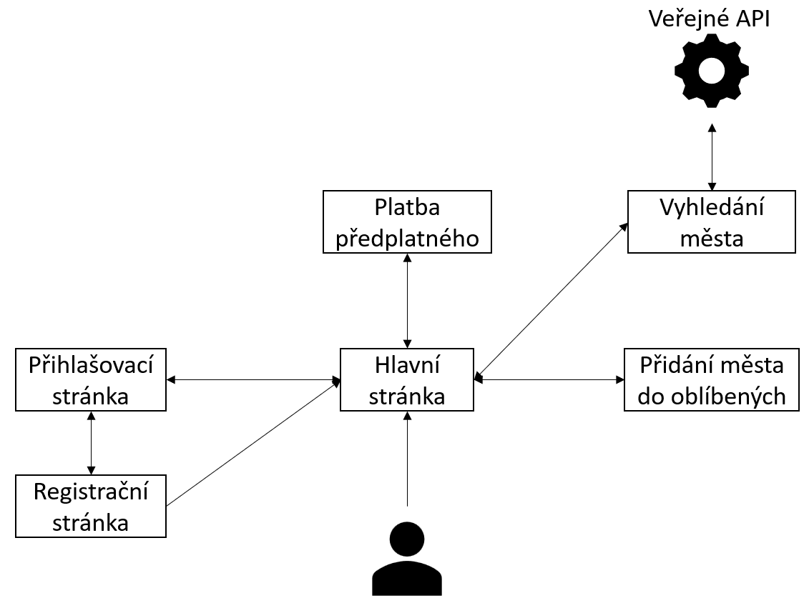
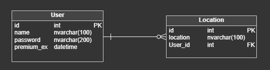

 

# Systém předpovědi počasí

---
### Softwarové inženýrství
### Jakub Klimo
---

## Popis aplikace
Aplikace má za úkol řešit systém pro předpověď počasí, který by měl zobrazovat aktuální počasí, předpověď na následující dny a historii počasí za poslední dny. Aplikace umožní uživatelům vytvořit si vlastní účet a předplatit si službu, která jim umožní ukládat oblíbené lokace a prohlížet historii počasí. Bude dostupná jak na počítačích, tak i na mobilních telefonech a nabídne uživatelské rozhraní podobné webovému prohlížeči.

Data o počasí budou získávána z veřejně dostupného API, které poskytuje komplexní informace o počasí v různých formátech.

## Využité technologie
- Programovací jazyk: Python 3.11.9
- Nadstavba: Flask
- Databáze: MySQL
- Internetové připojení

## Softwarové požadavky
- Webový prohlížeč - Chromium - verze 120.xxx a výše

## Uživatelské rozhraní - GUI
Aplikace je v anglickém jazyce. Systém se bude skládat z několika webových stránek:
1. Registrační stránka
   - Uživatel zadá jmeńo, heslo, potvrzovací heslo a potvrdí registraci
2. Přihlašovací stránka
   - Uživatel zadá jméno, heslo a přihlásí se
3. Hlavní stránka aplikace
   - Když není uživatel přihlášen:
     - Zobrazení aktuálního pačasí buď pro aktuální polohu, nebo pro vyhledanou polohu
     - Možnost přihlášení
   - Když je uživatel přihlášen:
     - Zobrazení aktuálního počasí a předpovědi pro následující dny buď pro aktuální polohu, nebo pro vyhledanou polohu
     - Možnost pořízení předplatného
     - Možnost okamžitého odhlášení
   - Když má uživatel předplatné:
     - Zobrazení aktuálního počasí, předpovědi pro následující dny a historie pro předchozí dny buď pro aktuální polohu, nebo pro vyhledanou polohu
     - Možnost přidat vyhledanou polohu do oblíbených a následně mít k této poloze rychlý přístup
     - Možnost prodloužení předplatného
     - Možnost okamžitého odhlášení
4. Stránka pro pořízení/prodloužení předplatného:
   - Uživatel zadá číslo karty a zvolí si na jak dlouho si chce pořídit předplatné

## Chybové stavy
Uživatel bude při chybě buď z jeho strany, nebo ze strany serveru upozorňován vhodnými prostředky tak, aby mu napomáhali tento problém vyřešit a aby docházelo ke správné činnosti systému.

Příklady chybových stavů pro uživatele:
- Špatně zadaná hodnota - systém zabrání potvrzení požadavku se špatně zadanou hodnotou a upozorní uživatele
Příklady chybových stavů pro administrátora:
- Chybné, žádné připojení databáze - systém nebude pokračovat, dokud databáze nebude správně spuštěna
- Nemožnost připojit systém k internetu - systém nebude pokračovat, dokud nebude moci úspěšně využívat funkčnosti použitého API

## UseCase diagram

## Návrh databáze

### Popis databáze
1. Tabulka uživatel
   - id - auto-inkrementace
   - name - název uživatele
   - password - heslo uživatele
   - premium_ex - datum vypršení předplatného
2. Tabulka lokace
   - id - auto-inkrementace
   - lacotion - název města/lokace
   - User_id - uživatel, pro kterého je město oblíbené
  
## Časová náročnost
Odhaduji, že čas strávený na projektu by se mohl rovnat 24 hodinám.
